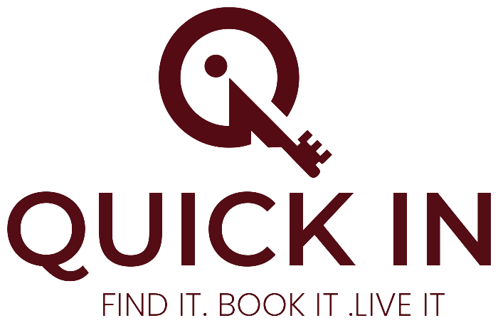

# QuickIn — Boutique Vacation Rental Platform

**QuickIn** is a premium, boutique vacation rental platform prototype (Airbnb-style) built with modern web technologies, focusing on high-end aesthetics, performance, and a seamless user experience across languages.



## 🚀 Teck Stack

- **Framework**: [Next.js 16](https://nextjs.org/) (App Router)
- **Language**: [TypeScript](https://www.typescriptlang.org/) (Strict Mode)
- **Frontend**: [React 19](https://react.dev/), [Tailwind CSS 4](https://tailwindcss.com/)
- **UI Components**: [shadcn/ui](https://ui.shadcn.com/) (Radix Primitives)
- **Backend & Auth**: [Supabase](https://supabase.com/) (PostgreSQL + RLS + Storage)
- **State Management**: [Zustand 5](https://zustand-demo.pmnd.rs/)
- **I18n**: [next-intl](https://next-intl-docs.vercel.app/) (English & Arabic with RTL)
- **AI Integration**: [Google Gemini](https://ai.google.dev/) (AI Chat Assistant)
- **Maps**: [React Leaflet](https://react-leaflet.js.org/)
- **Forms**: [react-hook-form](https://react-hook-form.com/) + [Zod 4](https://zod.dev/)

## ✨ Key Features

- **🏠 Boutique Listings**: High-fidelity listing discovery with advanced filtering.
- **🔐 Secure Auth**: Built-in multi-provider authentication (Google/GitHub/Email) via Supabase.
- **🌍 Full I18n**: Native support for English (LTR) and Arabic (RTL) with synchronized translation keys.
- **📊 User Dashboard**: Dedicated workspaces for both Travelers and Hosts.
- **🛠️ Admin Panel**: Robust, staff-only administrative tools for project management.
- **🤖 AI Assistant**: Integrated AI chat powered by Google Gemini for travel assistance.
- **📅 Booking Engine**: Real-time availability, bookings management, and automated timeouts via Vercel Cron.
- **🗺️ Interactive Maps**: Visual property exploration using Leaflet.
- **🖼️ Premium UI**: "Glassmorphism" aesthetics, warm boutique palette, and custom design tokens.

## 🛠️ Getting Started

### Prerequisites

- Node.js 20+
- npm
- Supabase account (for database/auth)
- Google Gemini API Key

### Installation

1. **Clone the repository**:
   ```bash
   git clone https://github.com/MohamedXIV/airbnb-prototype.git
   cd airbnb-prototype
   ```

2. **Install dependencies**:
   ```bash
   npm install
   ```

3. **Set up environment variables**:
   Create a `.env.local` file (see `docs/env-setup.md` for details):
   ```env
   NEXT_PUBLIC_SUPABASE_URL=your_supabase_url
   NEXT_PUBLIC_SUPABASE_ANON_KEY=your_supabase_anon_key
   SUPABASE_SERVICE_ROLE_KEY=your_service_role_key
   GEMINI_API_KEY=your_gemini_key
   ```

4. **Run the development server**:
   ```bash
   npm run dev
   ```

5. **Generate Database Types** (after schema changes):
   ```bash
   npm run gen-types
   ```

## 📖 Available Scripts

- `npm run dev` — Starts the development server.
- `npm run build` — Creates an optimized production build.
- `npm run lint` — Runs ESLint for code quality.
- `npm run gen-types` — Synchronizes TypeScript types with your Supabase schema.
- `npm run check:i18n` — Validates that English and Arabic translation keys match.

## 🎨 Architecture Overview

- `src/app/(main)/*` — Public marketing and discovery site.
- `src/app/(dashboard)/*` — Authenticated Traveler/Host dashboards.
- `src/app/admin/*` — Gated administrative interfaces.
- `src/components/features/*` — Feature-specific components (listings, search, dashboard, host, auth, etc.).
- `src/lib/supabase/*` — Centralized data layer and Supabase client configurations.

---

Built with ❤️ by the QuickIn Team.

