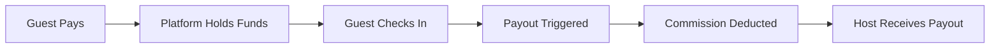

# Project Implementation Plan: Airbnb-Style Booking Platform (v1)

This document merges the original detailed implementation plan with the updated requirements for a local accommodation booking platform.

---

## 1. User Roles & Account System

The platform distinguishes between **two account tiers** with different security models:

### 1.1 Public Users (Guests & Hosts)

| Role | Description |
|------|-------------|
| **Guest** | Traveler who books accommodations |
| **Host** | Property owner who lists accommodations |

- A single account can act as **both Guest and Host** simultaneously (no separation)
- Users can seamlessly switch between hosting and booking within the same session
- Standard user authentication via Supabase Auth
- Each role has a dedicated dashboard view

> [!NOTE]
> The current UI implementation already supports this dual-role model — users can manage their listings (as Host) and bookings (as Guest) from the same account without issues.

### 1.2 Internal Staff (Admins & Service Providers)

| Role | Description |
|------|-------------|
| **Platform Admin** | Full system access, manages all entities |
| **Staff** | Limited admin capabilities based on assigned role |

> [!CAUTION]
> Internal staff accounts are **completely separate** from public user accounts and require enhanced security measures.

**Authentication (Supabase-native approach):**

All accounts use **Supabase Auth** (`auth.users`), but staff authentication is restricted:

| Requirement | Public Users | Staff/Admins |
|-------------|--------------|--------------|
| Public signup | ✅ Allowed | ❌ Disabled |
| Account creation | Self-registration | Invite-only / manual |
| Email restrictions | None | Company domain (optional) |
| MFA | Optional | ✅ Enforced |
| SSO | N/A | Optional (future) |

**Database Architecture:**
- `public.users` table → linked to `auth.users` (for guests/hosts)
- `public.staff` table → linked to `auth.users` (for admins/staff)
- Both tables reference `auth.users.id` as foreign key

**Hierarchical Staff Management:**
1. **Super Admin** → Creates admin accounts (via dashboard or direct DB)
2. **Admins** → Create staff accounts via dashboard with assigned roles
3. **Staff** → Limited capabilities based on their role/permissions

**Security Requirements:**
- **Database-level security** using Supabase Row Level Security (RLS) policies
- Role-based access control (RBAC) with granular permissions
- Audit logging for all admin actions

---

## 2. Host Features

### 2.1 Listing Management

- Create new property listings
- **Upload Photos**: Drag-and-drop interface for high-quality images
- **Location**: Interactive map integration (Google Maps/Mapbox) to pin exact property location
- **Details**: Add amenities, description, and house rules
- Each listing receives a **unique 4-digit listing code** (auto-generated)

### 2.2 Availability & Pricing

- **Calendar-Based Availability**: Define available dates using an interactive calendar
- **Variable Pricing**: Set a **daily price per date** (not a single fixed price)
- **Currency**: Egyptian Pound (EGP)
- **Additional Fees**: Set cleaning fees and service charges
- **Listing Rules**:
  - Minimum number of nights per booking
  - Special conditions (e.g., married couples only, or other custom rules)

### 2.3 Booking Request Management

When a Guest submits a booking request:
1. Host receives a **booking request notification**
2. Host can review request details (dates, total price)
3. Host can **confirm or reject** the booking request
4. If multiple booking requests exist, the Host chooses which request to confirm

---

## 3. Guest Features

### 3.1 Search & Discovery

- Browse and search listings
- Filter by location, price, dates, and amenities
- **Interactive Map**: View search results on a map
- View only **available dates** on listings
- View **per-day pricing** clearly before requesting a booking

### 3.2 Booking Flow (Request-Based)

> [!IMPORTANT]
> The booking system is **request-based**, not instant booking.

1. Guest selects desired dates
2. Guest views total price breakdown
3. Guest submits a **booking request**
4. Guest waits for Host confirmation before the booking becomes active

### 3.3 Payment Options

**Payment Gateway** supports local payment methods:
- Credit/Debit Cards
- **Vodafone Cash** (via payment processor integration or manual instruction flow)
- **InstaPay** (manual verification or QR code integration if API available)

### 3.4 Host Privacy Protection

| Stage | Host Details Visibility |
|-------|------------------------|
| Before booking confirmation | **Hidden** (name, phone number) |
| After booking confirmation | **Visible** |

---

## 4. Financial Workflow (Escrow System)

1. **Guest Pays**: Money collects in the Platform's merchant account (Stripe/Paymob/etc.)
2. **Hold Period**: Funds are held until the guest checks in
3. **Payout Trigger**: Upon successful check-in (or 24 hours after), the system triggers a payout
4. **Commission**: Platform automatically deducts its service fee (percentage)
5. **Host Payout**: Money is sent to the Host's wallet or bank account

---

## 5. Admin Dashboard

A centralized control panel for platform administrators:

### 5.1 Listings & Hosts Management

- View all listings with full details
- View Host information related to each listing
- Ban/approve hosts or guests

### 5.2 Financial Management

- View total revenue and held funds
- View Host payout account details (used for fund transfers)
- View booking-related financial data (for monitoring and payouts)
- Manually approve/process payouts to Hosts (if automated payout isn't used)
- Verify manual payments (receipts for Vodafone Cash/InstaPay)

### 5.3 Dispute Resolution

- Handle cancellations and refund requests

---

## 6. Dashboards Summary

### Host Dashboard
- Listings management
- Availability & pricing calendar
- Booking requests (pending/confirmed/rejected)

### Guest Dashboard
- Booking requests (pending)
- Confirmed bookings
- Booking history

### Admin Dashboard
- Listings overview
- Host details
- Financial and payout-related data
- User management

---

## 7. AI Agent & Help Center

### Smart Help Center
- Knowledge base with FAQs:
  - How to book
  - How to host
  - Payment issues

### AI Agent Integration
- Chatbot powered by LLM (e.g., Gemini/OpenAI)
- **Capabilities**:
  - Answer user queries
  - Suggest listings based on preferences
  - Assist with booking troubleshooting
  - Explain policies

---

## 8. Reviews & Ratings

- **Post-Stay Reviews**: Guests rate:
  - Cleanliness
  - Accuracy
  - Communication
  - Location
  - Value
- **Text Comments**: Reviews visible on the listing page
- **Host Ratings**: Aggregate score displayed on host profiles

---

## 9. Location Services

- **Interactive Map**: View search results on a map
- **Nearby Amenities**: When viewing a listing, show proximity to:
  - Restaurants/Cafes
  - Public Transport
  - Tourist Attractions
  - Supermarkets

---

## 10. Localization (Arabic Support)

- **RTL Support**: Full Right-to-Left layout adjustment for Arabic users
- **Language Toggle**: Switch between English and Arabic
- **Bilingual Content**: UI labels, notifications, and emails

---

## 11. Technical Considerations

| Component | Technology |
|-----------|------------|
| **Frontend** | Next.js |
| **Backend** | Supabase (Auth & Database) |
| **Payment Provider** | Paymob, Fawry, or Stripe (Egypt-specific support) |
| **Maps API** | Google Maps Platform or Mapbox |

---

## 12. Key Clarifications

> [!NOTE]
> These are critical system behaviors to keep in mind during implementation:

- The booking system is **request-based**, not instant booking
- Availability and pricing are **date-based**, not static
- Privacy between Guest and Host is enforced until booking confirmation
- Admin has full visibility over all entities
